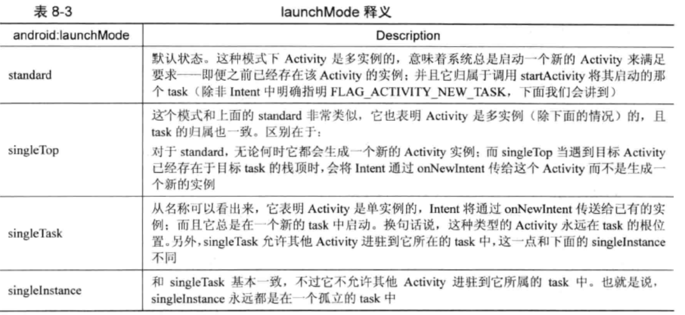

###### 1,Activity Manager Service
&nbsp;&nbsp;ActivityManagerService(AMS)是Android提供的一个用于管理Activity(和其他组件)运行状态的系统进程，也是我们编写APK应用程序时使用最频繁的一个系统服务。

&nbsp;&nbsp;重要的两个核心ActivityStack和ActivityTask；
&nbsp;&nbsp;ActivityStack时activity的记录者与管理者，同时也为AMS管理系统运行情况提供了基础。
&nbsp;&nbsp;Task是Android应用程序中的一大利器。

&nbsp;&nbsp;AMS是寄存与systemServer中的。它会在系统启动时，创建一个线程来循环处理客户的请求。AMS回向ServiceManager登记多种Binder Server, 如：“activity”，“meminfo”，“cpuinfo”等，不过只有第一个“activity”才是AMS的主业，并由ActivityManagerService实现； AMS的启动过程，如下：  

```
/*frameworks/base/services/java/com/android/server/SystemServer.java*/
private void startBootstrapServices() {
    ...
    // Activity manager runs the show.
    traceBeginAndSlog("StartActivityManager");
    mActivityManagerService = mSystemServiceManager.startService(
            ActivityManagerService.Lifecycle.class).getService();
    mActivityManagerService.setSystemServiceManager(mSystemServiceManager);     //向Service Manager注册
    mActivityManagerService.setInstaller(installer);
    traceEnd();

    ...
}

```

&nbsp;&nbsp;待补充...


**组件状态管理：**  
&nbsp;&nbsp;这里的组件不仅仅指activity，而是所有四大组件。状态管理包括组件的开启，关闭等一系列操作，如startActivity, startActivityAndWait, activityPaused, startService, removeContentProvider等。


&nbsp;&nbsp;AMS的任务只是负责保管activity（及其他组件）的状态信息，而像activity中描述的UI界面如何在物理屏幕上显示等工作则是由WindowManagerService和SurfaceFlinger来完成的。   


###### 2，startActivity的流程
&nbsp;&nbsp;相信大家对startActivity(intent)的功能不会陌生。它用于启动一个目标activity， 具体是哪个activity则是AMS通过对系统中安装的所有程序包进行“Intent匹配”得到的，并不局限于调用者本身所在的package范围。换句话说，startActivity()最终很可能启动的是其他进程中的组件。当系统匹配到某个目标activity后分为两种情况。

* 如果通过intent匹配到的目标对象，其所属程序包中已经有其他元素在运行（意味着该程序进程已启动），那么AMS就会通知这个进程来加载运行我们指定的目标activity。

* 如果当前activity所属程序没有进程在运行，AMS就会先启动它的一个实例，然后让其运行目标activity。


###### 3, 启动模式

